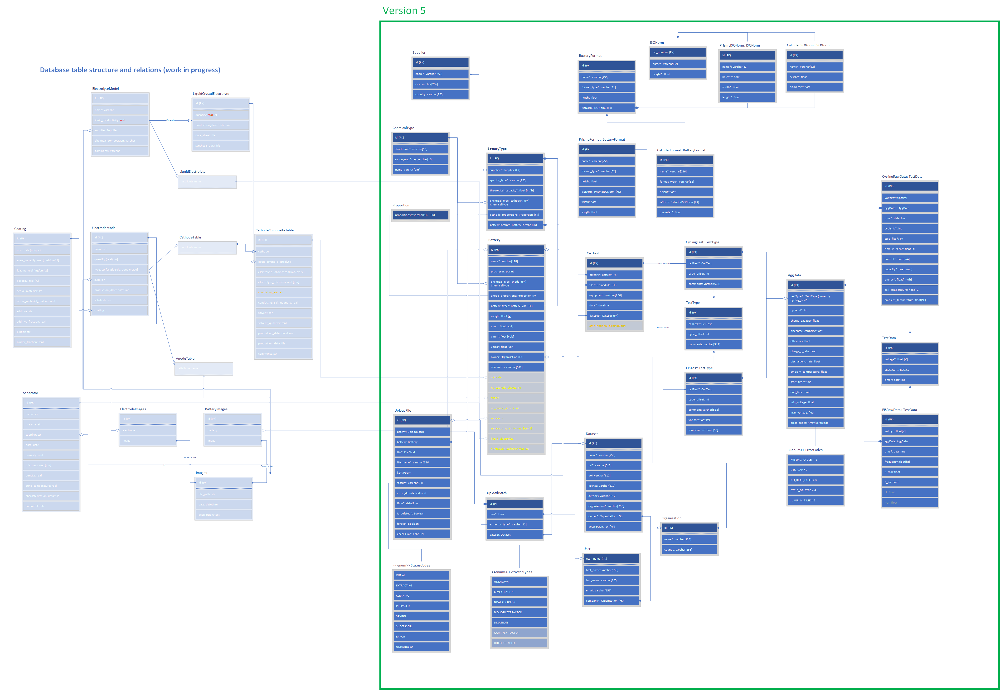

# ABD Database Design
The database is generated 'Code-First', that means the classes are written in python and the Django-Framework generates the actual tables in the database.
## Version 5
In the alpha version of the implemented models we only focus on the right half marked in the green box. The left half is used in later use-cases that requires adding more detailled data that we can't extract from our datasources.  

