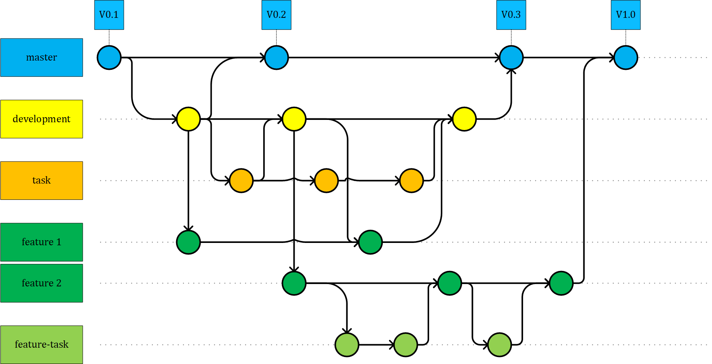

# Git workflow
Description of the Git workflow for this project, defined in two sections. One for a general defintion of the workflow and one for the actual branches.
## General definition
The Git workflow for this project is defined as following:

### master-Branch:
This is branch must be always fully functional and can be running on a production server.
A pullrequest is necessary to merge the changes from the **development**-branch. As reviewer at least one *owner* or *maintainer* aswell as at least one *developer* (that hasn't made changes) have to accept the request.
### development-Branch:
All changes that are made during the process are merged into this branch. All the features are tested and approved together in this branch before merging into the **master**-branch.
A pullrequest is necessary to merge the changes from the **task**- or **feature**-branch. As reviewer at least one *Owner* or *Maintainer* aswell as at least one *Developer* (that hasn't made changes) have to accept the request.
### task-Branch:
The task-branch contains only one minor task/bugfix and is ***always*** branched off from the **development**-branch.
The changes are tested separately in this branch before being merged back into the **development**-branch.
Since task-branches are short per definition and shouldn't depend on any changes made outside of the branch, there is no need for any merges into these branches and so also no pullrequest.
### feature-Branch:
The feature-branch contains only one bigger feature and is ***always*** branched off from the **development**-branch.
The changes are tested separately in this branch before being merged back into the **development**-branch.
Pullrequests from the children('s) feature-tasks-branches are not required and optional within the *developers*.

### feature-task-Branch:
Optional branch if the feature is too big to handle in one branch. Always get's branched from parent's **feature**-branch.
Ideally changes already get tested here but at least after merging to the parent's branch.

## Actual Branches
The actual Git workflow for this project is following:

### calender_aging
Goal of the branch is to implement the calender-aging prediction for the batteries.  
The main source of information are:
- Hidden-Project

### 53-upload-list
This branch is used to develop an overview of the made file-uploads. It should be possible to restart or reupload the file if an error occured and also to forget the file if it has a not-fixable error.  
The main source of information are:
- TBD

### 24-support-for-EIS-data
Goal of the branch is to prepare the database and the extractor to handle EIS data in the files.
The main source of information are:
- Hidden-Project

### 31-extend-battery-data
This branch is used to develop a workflow to add new data to an existing battery.
The main source of information are:
- Hidden-Project

### 50-checksum
Implement a checksum method to check and compare the contents of the uploaded files.
The main source of information are:
- https://en.wikipedia.org/wiki/MD5
- https://www.scivision.dev/check-hdf5-corruption-error/
  - https://github.com/scivision/hdf5-tester

### Branching and Merging
The authentication-branch is created directly from the **development**-branch and if possible should always include all the changes made in the **development**-branch.  
The changes get merged back in the parents-branch in the end of the **feature** when a solid part of the work is done or everything is ***complete and working***.
### Archive
The following branches have been deleted during a clean up.  
#### ***12.09.2022***
##### authentication
Goal of the branch is to implement authentication to the website and database.  
The main source of information are:
- Hidden-Project
- https://docs.djangoproject.com/en/4.0/topics/auth/

##### jobqueue
This branch is used to develop a job queue for the fileupload. The website should not get stuck  waiting for a response. The queue should be visible.  
The main source of information are:
- https://docs.python.org/3/library/queue.html
- https://django-formtools.readthedocs.io/en/latest/index.html
- https://github.com/astahlhofen/formtools-wizard-multiple-fileupload

#### ***13.04.2022***
##### Plotting
**merged**
The branch is for developing plotted graphics to show EIS and Cycling data.
The branch is handled as a **feature**-branch.  
The main sources of information are:

- Hidden-project
- https://plotly.com/python/

##### PostgresDb
**merged**
Goal of this branch is to switch from SQLite to Postgres and use the Timescale Extension for more performance. Also, the ERD changes a bit due to discussed improvements. As a result the extraction algorithm changes according to the changes made in the models and also represented in the templates.  
The main sources of information are:
- Hidden-project
- https://github.com/schlunsen/django-timescaledb
- https://docs.timescale.com/

##### Transaction
**merged**
Goal of this branch is to add more detailled errorhandling and a transaction functionality that either the whole data or none get's saved in to the database.  
The main sources of information are:
- https://docs.djangoproject.com/en/4.0/topics/db/transactions/
- https://docs.djangoproject.com/en/4.0/ref/contrib/messages/
- https://getbootstrap.com/docs/4.0/components/alerts/

##### Styling
**merged**
Goal of this branch is to add some styling to the website aswell as new templates to visualize and plott data.  
The main sources of information are:
- Hidden-Project
- https://getbootstrap.com/docs/5.1/getting-started/introduction/

##### logging
**merged**
Added meaningfull log messages for the base-extractor and it's helper classes.
The main sources of information are:
- https://docs.python.org/3/howto/logging.html
- https://realpython.com/python-logging/
#### ***25.11.2021***
##### Branching and Merging
The InputForm- and ImportData-branch is created directly from the **development**-branch and if possible should always include all the changes made in the **development**-branch.  
The changes get merged back in the parents-branch in the end of the **feature** when everything is ***complete and working***.  
The PopupForm-branch's parent is the **InputForm**-branch. Only if necessary the changes made in the parent's branch should be merged into this branch.  
The changes get merged back in the **InputForm**-branch in the end of the task when everything is ***complete and working***.
##### InputForm
**merged**  
This branch is for developing an Input Form for adding manually a new BatteryTable.  
The branch is handled as a **feature**-branch.  
The main sources of information are:
- Hidden-project
- https://docs.djangoproject.com/en/3.2/topics/forms/

##### PopupForm
**deleted**  
This branch is for developing a Popup Form for adding manually a new Supplier for example, without leaving the main form.  
The branch is handled as a **feature-task**-branch.  
The main sources of information are:
- https://pypi.org/project/django-bootstrap-modal-forms/
- https://github.com/trco/django-bootstrap-modal-forms/

##### ImportData
**merged**  
This branch is for developing the data importer to extract data out of a h5-file and save it to the selected battery in the database.  
The branch is handled as a **feature**-branch.  
The main sources of information are:
- Hidden project
- https://portal.hdfgroup.org/display/HDF5/HDF5
- https://pandas.pydata.org/docs/
- https://numpy.org/doc/stable/
