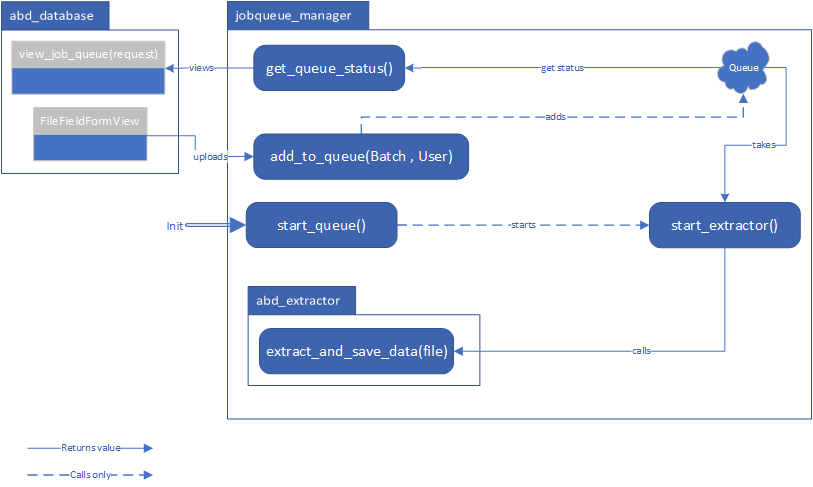

# Upload Queue
Goal of this section is to declare the functionality of the upload queue for the fileupload.
## Overview

The **jobqueue_manager** gets initialized on startup with the **start_queue()**-method, which start's a new thread with the **start_extractor()**-method. This method has to be running permanently because it's takes periodically the files uploaded to the queue. To ensure the method is always running there is a **is_alive()**-method which is not shown on the diagram.  
From the views in the **abd_database**-package the user can upload via a fileupload-form HDF5-files and push it to the queue with the **add_to_queue()**-method. The selected files is the first input as a Batch-object. As second parameter is the user which is logged in while uploading the files. The second call from **abd_database** is to get the queue status with the **get_queue_status()**-method which returns anonymized data from the queue.  

## Queue Limits
To ensure the apache-server can handle the uploaded files there is a total size limit for the queue. Also, to ensure one user can't fully occupy the queue there is a limit for the batch of selected files.  
The limits are hard-coded in **queue_settings.py** and are currently set to:

**RELEASE:**
- max_queue_size = 4.5e9  # 4'500'000'000byte -> 4'500'000kb -> 4.5gb
- max_batch_size = 9.8e8  # 980'000'000byte -> 980'000kb -> 980mb

**DEBUG:**
- max_queue_size = 12e9  # 12'000'000'000byte -> 12'000'000kb -> 12gb
- max_batch_size = 5e9  # 5'000'000'000byte -> 5'000'000kb -> 5gb

### Checks
The limits are checked serverside as well as clientside to ensure full control.  
The clientside check get hit before the files are uploaded to the server. The serverside check is hit right after the upload but before the files are handled.
